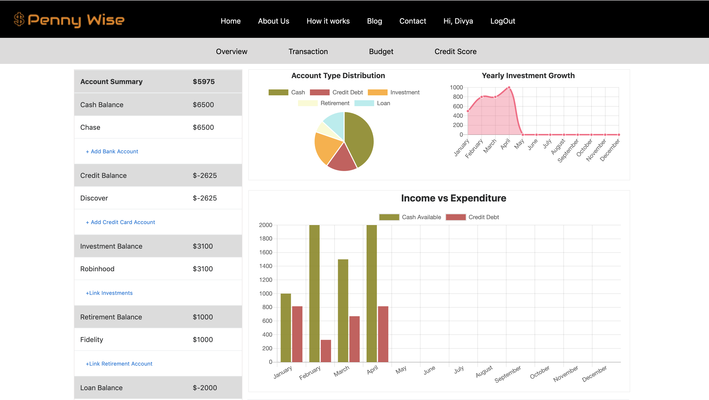
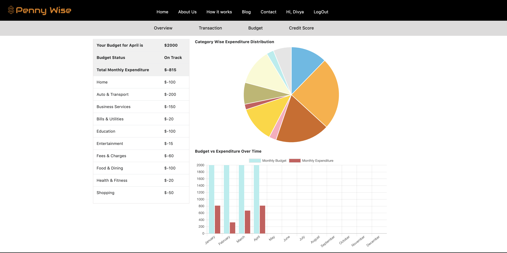

# PennyWise
- Built a single page application using MEAN stack which tracks expenses and analyzes spending habits for personal finance management 
- Created a responsive UI & dashboard for data visualization using Angular and implemented JWT web token based user authentication

## Screenshots
- Screenshot 1:

- Screenshot 2:

## Technologies
- MongoDB
- Express
- Angular
- Node.js
- HTML
- CSS
- JavaScript
- Bootstrap
- Passport.js
